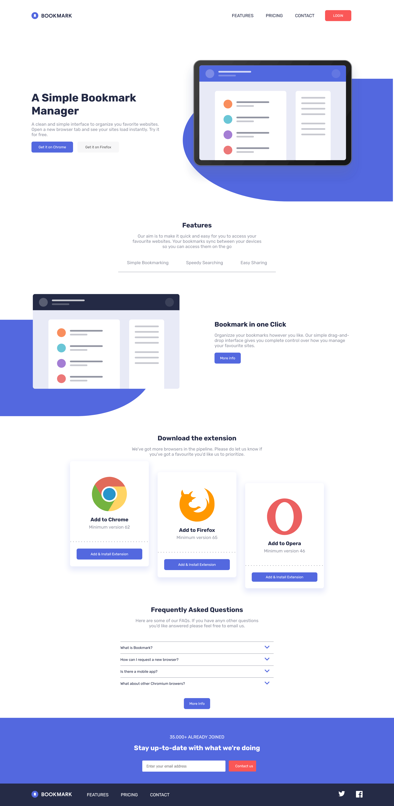

# Frontend Mentor - Bookmark landing page solution

This is a solution to the [Bookmark landing page challenge on Frontend Mentor](https://www.frontendmentor.io/challenges/bookmark-landing-page-5d0b588a9edda32581d29158). Frontend Mentor challenges help you improve your coding skills by building realistic projects.

## Table of contents

- [Overview](#overview)
  - [The challenge](#the-challenge)
  - [Screenshot](#screenshot)
  - [Links](#links)
- [My process](#my-process)
  - [Built with](#built-with)
  - [What I learned](#what-i-learned)
  - [Continued development](#continued-development)
  - [Useful resources](#useful-resources)
- [Author](#author)

## Overview

### The challenge

Users should be able to:

- View the optimal layout for the site depending on their device's screen size
- See hover states for all interactive elements on the page
- Receive an error message when the newsletter form is submitted if:
  - The input field is empty
  - The email address is not formatted correctly

### Screenshot

Desktop Version

### Links

- Solution URL: [Add solution URL here](https://your-solution-url.com)
- Live Site URL: [Add live site URL here](https://your-live-site-url.com)

## My process

### Built with

- Semantic HTML5 markup
- CSS custom properties
- Flexbox
- CSS Grid
- Javascript

### What I learned

- Learned how to create an accordion with html, css and javascript
- CSS-only carousel

### Continued development

Use this section to outline areas that you want to continue focusing on in future projects. These could be concepts you're still not completely comfortable with or techniques you found useful that you want to refine and perfect.

**Note: Delete this note and the content within this section and replace with your own plans for continued development.**

### Useful resources

- [CSS-Only Carousel](https://css-tricks.com/css-only-carousel/)
- [Example resource 2](https://www.w3schools.com/howto/howto_js_accordion.asp)
- [How do you make the radio button text to be clickable too?](https://stackoverflow.com/questions/19412204/how-do-you-make-the-radio-button-text-to-be-clickable-too)
- [CSS: Sliding an image with radio:checked (Pure CSS slider)](https://stackoverflow.com/questions/42405127/css-sliding-an-image-with-radiochecked-pure-css-slider)
- [Building a Simple FAQ Accordion with HTML, CSS, and JavaScript](https://medium.com/@francesco.saviano87/building-a-simple-faq-accordion-with-html-css-and-javascript-2a8aed32badf)
- [nextElementSibling not capturing CSS style](https://stackoverflow.com/questions/63508460/nextelementsibling-not-capturing-css-style)

## Author

- Website - [Add your name here](https://www.your-site.com)
- Frontend Mentor - [@yourusername](https://www.frontendmentor.io/profile/yourusername)
- Twitter - [@yourusername](https://www.twitter.com/yourusername)
